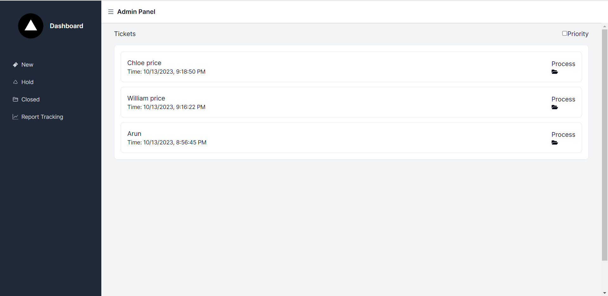
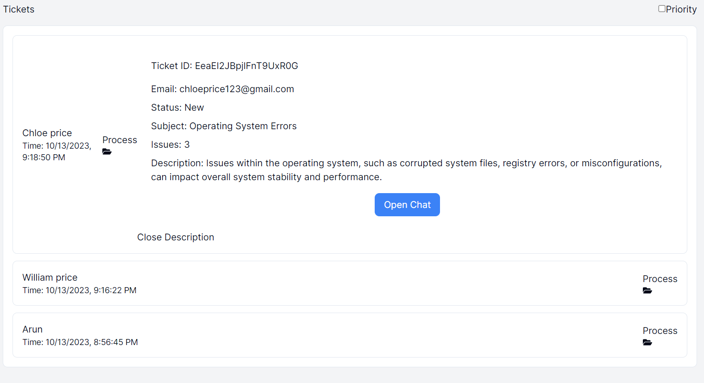
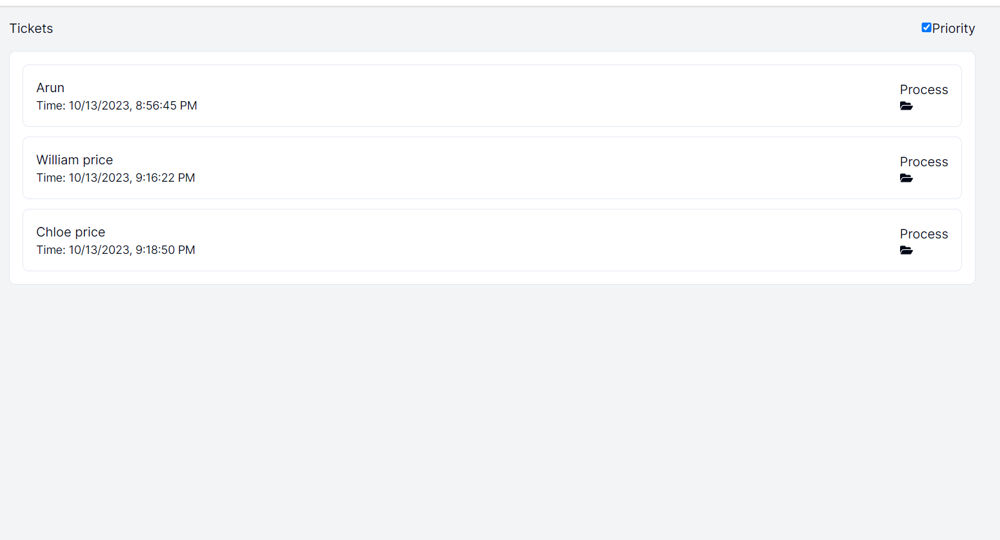
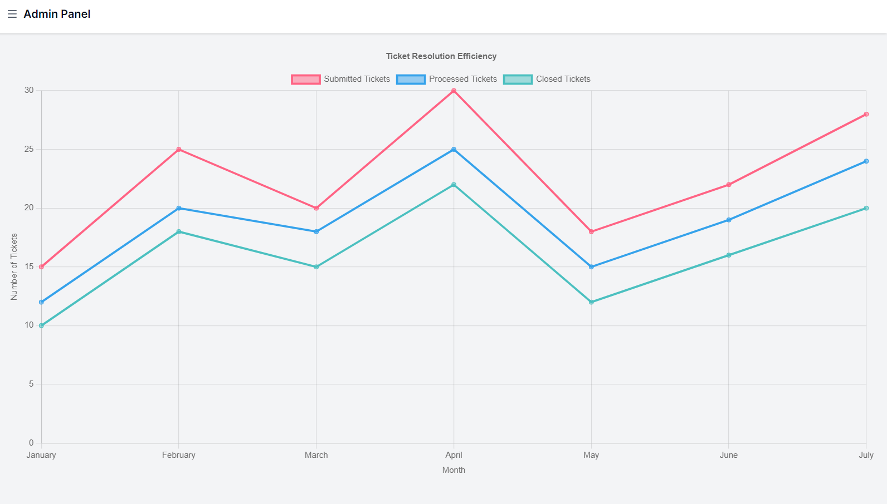

## Support Agent Dashboard:

### Admin Accounts:[Check Out Here](https://ticketing-system-support-agent-xcs4.vercel.app/)

- Two support agents: "Admin1" and "Admin2."
- Admin emails: admin1@gmail.com and admin2@gmail.com.
- Only Admin emails are allowed

### Features:

1. **Dashboard:**
   - View tickets raised by customers.
   - Option to chat with customers.

      

2. **Ticket Management:**
   - Change the status of tickets (New, Hold, Closed).
   - Pages for new, on-hold, and closed tickets.
     
     

3. **Ticket Sorting:**
   - Sort tickets by priority for efficient handling.
     
     

4. **Analytics:**
   - Report analytics page to assess ticket resolution efficiency.
     
     
